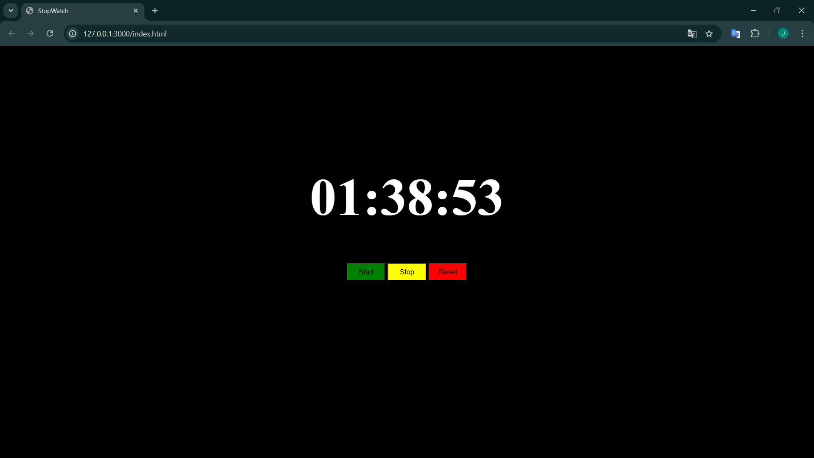

##Image of Software
###Stopwatch


## Como clonar e rodar o projeto localmente
1. **Clone o repositório**
   
   Use o comando abaixo no seu terminal para clonar o repositório:
   ```bash
   git clone https://github.com/jefersonprimer/stopwatch.git

2. **Entre na pasta do projeto**
    cd stopwatch


